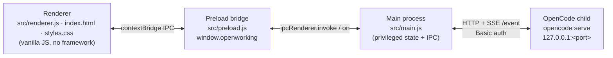
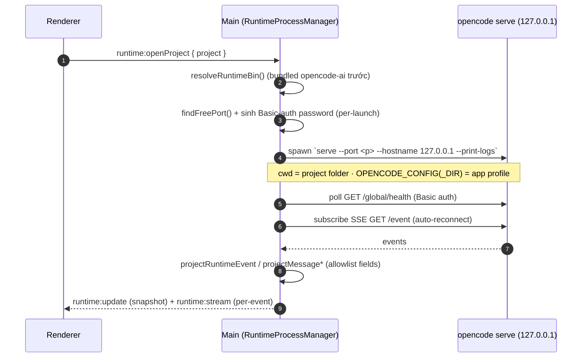

# Architecture Overview (as-built)

> **Loại tài liệu:** As-built architecture reference. Mô tả hiện trạng code, không phải kế hoạch.
> **Phạm vi:** `desktop-client/` (Electron app). Backend/contract phía AI Console nằm ở workspace-root `/docs`.
> **Đối tượng:** kỹ sư mới + AI agent (Claude/Codex) cần bản đồ tổng thể trước khi sửa code.

## Context

TechTusCoWork là vỏ Electron local-first bọc upstream OpenCode AI. App nhúng sẵn `opencode-ai`, chạy `opencode serve` trong thư mục project mà người dùng chọn, và quản lý một OpenCode profile riêng dưới Electron `userData` — **không** ghi vào project folder hay `~/.config/opencode` toàn cục.

Tài liệu này chỉ tả những gì **không suy ra nhanh được từ code**: đường đi giữa 3 process, vòng đời runtime, các ranh giới bảo mật, và bản đồ module↔test. Chi tiết từng miền nằm ở các doc được link.

## 1. Three-process model

- **Renderer** (`src/renderer.js`, ~5k dòng, `src/index.html`, `src/styles.css`): single-page UI vanilla-JS, không framework. Tiêu thụ `runtime:update`/`runtime:stream` để render thread sống.
- **Preload** (`src/preload.js`): mặt phẳng API **duy nhất** giữa renderer↔main, expose qua `contextBridge` thành `window.openworking`. `contextIsolation: true`, `nodeIntegration: false` (xem `createWindow` trong `src/main.js`). Mọi capability mới phải đi qua đây.
- **Main** (`src/main.js`): giữ toàn bộ state đặc quyền + đăng ký IPC handler. Singletons: `ProjectRegistry`, `RuntimeProcessManager`, `AttachmentRegistry`, `LocalLlmProxy`, `AuthSession`, OpenCode profile đã resolve. Push update bất đồng bộ về renderer qua helper `send(channel, payload)` (`src/main.js:80`).

## 2. IPC surface

Mặt phẳng đầy đủ định nghĩa ở `src/preload.js`; handler ở `src/main.js` (đăng ký trong `registerIpc`). Đây là bản chụp hiện tại — đối chiếu lại bằng `grep -nE 'ipcMain\.(handle|on)\(' src/main.js`.

| Nhóm | Kênh `invoke` (renderer → main) | Module xử lý chính |
|---|---|---|
| `auth:*` | `getSession`, `refresh`, `login`, `logout` | `src/auth-session.js` |
| `projects:*` | `list`, `add`, `remove`, `rename`, `touch` | `src/project-registry.js` |
| `config:*` | `get`, `save` | `src/opencode-profile.js`, `src/opencode-config.js` |
| `skills:*` | `upload`, `installPath`, `read`, `uninstall` | `src/opencode-profile.js` |
| `mcp:*` | `list`, `add`, `update`, `setEnabled`, `remove`, `status`, `authenticate`, `clearAuth`, `openDocs` | `src/opencode-profile.js` + runtime |
| `attachments:*` | `pick`, `addProjectFile`, `discard` | `src/attachment-registry.js`, `src/office-attachment-context.js` |
| `artifacts:*` | `open`, `preview` | `src/artifact-path.js` |
| `files:*` | `read`, `list` | `src/artifact-path.js` |
| `clipboard:*` | `writeText` | electron `clipboard` |
| `version:*` | `check`, `downloadAndInstall` | `src/version-check.js` |
| `runtime:*` | `get`, `openProject`, `start`, `stop`, `listSessions`, `listCommands`, `createSession`, `renameSession`, `sendPrompt`, `sendCommand`, `abortSession`, `deleteSession`, `listMessages`, `answerQuestion`, `rejectQuestion`, `replyPermission` | `src/runtime/process-manager.js` |

**Kênh push (main → renderer)**, qua `send()`:
- `runtime:update` — snapshot state runtime (status, sessions, diagnostics).
- `runtime:stream` — từng event đã chiếu nhỏ (per-event).
- `version:gate`, `version:download-progress`, `version:install-status` — luồng cập nhật app.

`RuntimeProcessManager` nhận chính hàm `send` qua tham số `emit` (`src/main.js:474-479`), nên nó tự phát `runtime:update`/`runtime:stream`.

## 3. Runtime lifecycle — `RuntimeProcessManager`

Trái tim của app: `src/runtime/process-manager.js`.

Điểm cần biết:
- **Resolve binary** (`resolveRuntimeBin`): ưu tiên `opencode-ai` / `opencode-<platform>-<arch>` đã nhúng hơn CLI toàn cục. Packaging giữ chúng unpacked khỏi asar.
- **Spawn args**: `serve --port <free> --hostname 127.0.0.1 --print-logs` (`src/runtime/process-manager.js:617`). Override bằng `OPENWORKING_RUNTIME_ARGS`. `--print-logs` route log có cấu trúc của opencode ra stderr → vào Diagnostics (cần cho việc chẩn đoán lỗi MCP).
- **Auth**: server bind **chỉ** `127.0.0.1`, yêu cầu HTTP Basic auth với password ngẫu nhiên mỗi lần chạy (`OPENCODE_SERVER_PASSWORD`).
- **Projection**: event/message thô của opencode được chiếu xuống shape rút gọn (`projectRuntimeEvent`, `projectMessage*`) — chỉ field trong allowlist mới qua biên giới. Xem `03-skills-runtime/built-in-skills.md` cho commands/MCP và [[message-part-allowlist]].
- **Multi-session**: lõi opencode hỗ trợ session đồng thời; renderer giữ Map-of-threads + per-session badge. Stream per-session đi qua `src/thread-stream.js` (parse/assemble message parts).

## 4. App-managed OpenCode profile

`src/opencode-profile.js` + `src/opencode-config.js`. **Invariant local-first:** mọi config/skills sống dưới `userData/opencode-profile/`.

- `ensureOpenworkingProfile` (chạy lúc launch + open-project) đồng bộ idempotent skills/tools từ `resources/opencode/` vào profile, dùng SHA-256 digest + manifest (`.openworking-skills.json`/`.openworking-tools.json`) để bỏ qua phần không đổi và xoá phần đã gỡ.
- `opencode.json` được **validate offline** bằng Ajv với schema nhúng (`resources/opencode/schemas/`) trước khi ghi — input sai (vd modality lạ) bị từ chối mà không đổi file đã lưu.
- Config screen chỉ sửa: provider `baseURL`/`apiKey`, model **input** modalities, optional plugins, skill toggles. Phần còn lại read-only. API key bị redact khỏi JSON preview.

## 5. Auth + LLM proxy lane

Tóm tắt vai trò (contract chi tiết ở `02-auth/`):
- `src/auth-session.js` + `src/auth-secret-store.js`: Portal Hub SAML2 login qua AI Console, lưu **chỉ** refresh token (Electron `safeStorage`), access token & Gateway JWT chỉ ở memory. → [`02-auth/sso-login-and-llm-token.md`](../02-auth/sso-login-and-llm-token.md).
- `src/local-llm-proxy.js`: proxy 127.0.0.1 random-port; OpenCode chỉ thấy `TECHTUS_LOCAL_PROXY_TOKEN`, proxy mới đổi sang Gateway JWT khi forward. → [`03-skills-runtime/local-llm-proxy.md`](../03-skills-runtime/local-llm-proxy.md).

## 6. Module supporting cast

| File | Trách nhiệm | Doc chi tiết |
|---|---|---|
| `src/attachment-registry.js` | Vòng đời file attachment (allowlist id↔path) | [attachments-office-context](../03-skills-runtime/attachments-office-context.md) |
| `src/office-attachment-context.js` | Trích ngữ cảnh XLSX/PPTX có giới hạn | 〃 |
| `src/artifact-path.js` | Security boundary `artifacts:open`/`files:*` (realpath confine) | 〃 |
| `src/version-check.js` | Version check + download + auto-install DMG | [version-check-update](../04-release-packaging/version-check-update.md) |
| `src/diff-view.js` | Parse unified diff → rows (UMD, unit-test được, không DOM) | — |
| `src/document-tools/` | Runtime độc lập cho skill `translate-document` (bundle riêng) | [built-in-skills](../03-skills-runtime/built-in-skills.md) |

## 7. Security boundaries (giữ nguyên — không nới)

- Runtime server bind **chỉ** `127.0.0.1` + Basic auth per-launch.
- `assertTranslationArtifact` (`src/artifact-path.js`) confine `artifacts:open` về artifact dịch hợp lệ qua realpath — gate `shell.openPath`. `assertProjectFile`/`assertProjectDirectory` confine `files:*` trong project root.
- Biên renderer↔main hẹp: thêm capability qua `preload.js`; chiếu event/message xuống field allowlist thay vì forward object opencode thô.
- Redact: `Authorization`, `apiKey`, `TECHTUS_LOCAL_PROXY_TOKEN`, các giá trị token-like trong diagnostics/logs. Không ghi Gateway JWT / AI Console token / SAMLResponse.

## 8. Module ↔ test map

Test là `node:test` thuần dưới `test/`, một file/module. Chạy: `npm test` (hoặc `node --test test/<file>`).

| Module | Test |
|---|---|
| `src/project-registry.js` | `test/project-registry.test.js` |
| `src/opencode-profile.js` / `opencode-config.js` | `test/opencode-profile.test.js`, `test/config.test.js` |
| `src/runtime/process-manager.js` | `test/runtime-process-manager.test.js`, `test/opencode-skill-integration.test.js` |
| `src/thread-stream.js` | `test/thread-stream.test.js` |
| `src/renderer.js` | `test/renderer.test.js` |
| `src/auth-session.js` / `auth-secret-store.js` | `test/auth-session.test.js`, `test/auth-secret-store.test.js` |
| `src/local-llm-proxy.js` | `test/local-llm-proxy.test.js` |
| `src/attachment-registry.js` | `test/attachment-registry.test.js` |
| `src/office-attachment-context.js` | `test/office-attachment-context.test.js` |
| `src/artifact-path.js` | `test/artifact-path.test.js` |
| `src/version-check.js` | `test/version-check.test.js` |
| `src/diff-view.js` | `test/diff-view.test.js` |
| `src/document-tools/` | `test/document-tools.test.js` |
| `scripts/release.js` | `test/release.test.js` |

Smoke ngoài unit test: `npm run smoke:electron` (chạy thật opencode serve), `npm run smoke:packaged` (build `.app`, assert runtime/skills/tools + chạy với PATH tối thiểu). Xem [`04-release-packaging/local-run-verification.md`](../04-release-packaging/local-run-verification.md).
