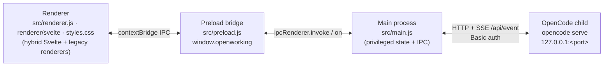
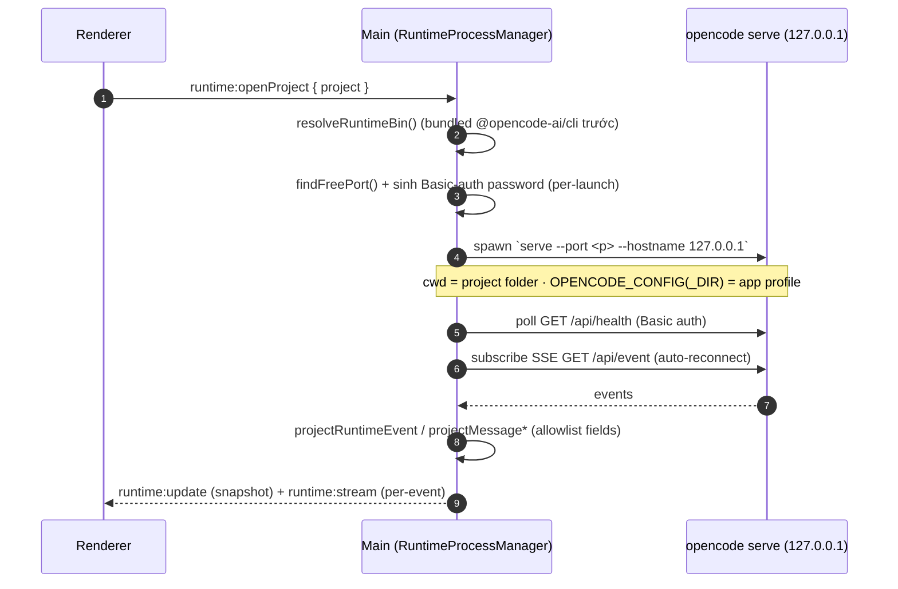

# Architecture Overview (as-built)

> **Loại tài liệu:** As-built architecture reference. Mô tả hiện trạng code, không phải kế hoạch.
> **Phạm vi:** `desktop-client/` (Electron app).
> **Đối tượng:** kỹ sư mới + AI agent cần bản đồ tổng thể trước khi sửa code.

## Context

OpenWorking là vỏ Electron local-first bọc upstream OpenCode AI. App nhúng sẵn `opencode-ai`, chạy `opencode serve` trong thư mục project mà người dùng chọn, và quản lý một OpenCode profile riêng dưới Electron `userData` — **không** ghi vào project folder hay `~/.config/opencode` toàn cục.

Tài liệu này chỉ tả những gì **không suy ra nhanh được từ code**: đường đi giữa 3 process, vòng đời runtime, các ranh giới bảo mật, và bản đồ module↔test. Chi tiết từng miền nằm ở các doc được link.

## 1. Three-process model

```mermaid
flowchart LR
  R["Renderer<br/>src/renderer.js · renderer/svelte · styles.css<br/>(hybrid Svelte + legacy renderers)"]
  P["Preload bridge<br/>src/preload.js<br/>window.openworking"]
  M["Main process<br/>src/main.js<br/>(privileged state + IPC)"]
  O["OpenCode child<br/>opencode serve<br/>127.0.0.1:&lt;port&gt;"]
  R <-->|"contextBridge IPC"| P
  P <-->|"ipcRenderer.invoke / on"| M
  M <-->|"HTTP + SSE /api/event<br/>Basic auth"| O
```

- **Renderer** (`src/renderer.js`, `src/renderer/svelte/`, `src/index.html`, `src/styles.css`): single-page UI hybrid. Svelte là render path bắt buộc cho app shell, sidebar, Projects, cụm Skills/Extensions/Memory, modal và một số viewer; Settings, composer, onboarding và message-part markup vẫn do renderer legacy tạo. `scripts/build-renderer.js` bundle Svelte thành `src/renderer/dist/svelte-islands.js`; mọi lệnh dev/test/package đều build bundle trước và app fail-fast nếu bundle thiếu. `renderer.js` vẫn sở hữu domain state/action, bridge các field cần reactive qua `state-bridge.svelte.js`, và chỉ truyền payload plain object/string qua preload.
- **Preload** (`src/preload.js`): mặt phẳng API **duy nhất** giữa renderer↔main, expose qua `contextBridge` thành `window.openworking`. `contextIsolation: true`, `nodeIntegration: false` (xem `createWindow` trong `src/main.js`). Mọi capability mới phải đi qua đây.
- **Main** (`src/main.js`): giữ toàn bộ state đặc quyền + đăng ký IPC handler. Singletons: `ProjectRegistry`, `RuntimeProcessManager`, `AttachmentRegistry`, OpenCode profile đã resolve. Push update bất đồng bộ về renderer qua helper `send(channel, payload)`.

## 2. IPC surface

Mặt phẳng đầy đủ định nghĩa ở `src/preload.js`; handler ở `src/main.js` (đăng ký trong `registerIpc`). Đây là bản chụp hiện tại — đối chiếu lại bằng `grep -nE 'ipcMain\.(handle|on)\(' src/main.js`.

| Nhóm | Kênh `invoke` (renderer → main) | Module xử lý chính |
|---|---|---|
| `projects:*` | `list`, `add`, `remove`, `rename`, `touch` | `src/project-registry.js` |
| `config:*` | `get`, `save` | `src/opencode-profile.js`, `src/opencode-config.js` |
| `skills:*` | `upload`, `installPath`, `read`, `uninstall` | `src/opencode-profile.js` |
| `mcp:*` | `list`, `add`, `update`, `setEnabled`, `remove`, `status`, `authenticate`, `clearAuth`, `openDocs` | `src/opencode-profile.js` + runtime |
| `attachments:*` | `pick`, `addProjectFile`, `discard` | `src/attachment-registry.js`, `src/office-attachment-context.js` |
| `artifacts:*` | `open`, `preview` | `src/artifact-path.js` |
| `files:*` | `read`, `list` | `src/artifact-path.js` |
| `git:*` | `info`, `checkoutBranch`, `switchWorktree` | `src/git-worktree.js` |
| `vcs:*` | `status`, `diff` | `src/runtime/process-manager.js` (`/api/vcs/*`) |
| `clipboard:*` | `writeText` | electron `clipboard` |
| `version:*` | `check`, `downloadAndInstall` | `src/version-check.js` |
| `runtime:*` | `get`, `openProject`, `start`, `stop`, `listSessions`, `listSessionsForDirectory`, `listSubagentRuns`, `listCommands`, `listModels`, `createSession`, `renameSession`, `selectSessionAgent`, `selectSessionModel`, `compactSession`, `stageSessionRevert`, `clearSessionRevert`, `commitSessionRevert`, `listPendingInputs`, `sendPrompt`, `sendCommand`, `abortSession`, `deleteSession`, `forkSession`, `listMessages`, `answerQuestion`, `rejectQuestion`, `replyPermission`, `listPendingForms`, `replyForm`, `cancelForm` | `src/runtime/process-manager.js` |

**Kênh push (main → renderer)**, qua `send()`:
- `runtime:update` — snapshot state runtime (status, sessions, diagnostics).
- `runtime:stream` — từng event đã chiếu nhỏ (per-event), gồm snapshot `subagent.run-tree.updated` khi cấu trúc/metadata/trạng thái cây thay đổi.
- `version:gate`, `version:download-progress`, `version:install-status` — luồng cập nhật app.

`RuntimeProcessManager` nhận chính hàm `send` qua tham số `emit`, nên nó tự phát `runtime:update`/`runtime:stream`.

Các IPC đọc project (`files:*`, `attachments:addProjectFile`, `artifacts:*`, `vcs:*`) nhận context `{ projectId, directory }`. Main process chỉ resolve `directory` khi nó khớp `path` hoặc `activeWorktreePath` trong `ProjectRegistry`, rồi mới áp dụng các gate realpath bên dưới. Vì vậy session đang xem có thể thuộc project/worktree khác runtime hiện chạy mà không làm renderer input trở thành filesystem authority.

Với `vcs:*` thì chính `resolveProjectContext` **là** toàn bộ boundary (không có gate realpath phía sau, vì dữ liệu trả về đến từ runtime API chứ không phải đọc đĩa): directory đã resolve được truyền thẳng cho `/api/vcs/*`, nên panel Changes luôn báo cáo đúng worktree đang active. → [`../features/vcs-changes-panel.md`](../features/vcs-changes-panel.md).

> Bảng trên chưa liệt kê đủ: `browser:*`, `catalog:*`, `memory:*`, `pins:*`, `profile:*` cũng đã đăng ký trong `registerIpc` nhưng thiếu hàng tương ứng. Dùng lệnh `grep` ở đầu mục này khi cần bản đầy đủ.

## 3. Runtime lifecycle — `RuntimeProcessManager`

Trái tim của app: `src/runtime/process-manager.js`.

```mermaid
sequenceDiagram
  autonumber
  participant UI as Renderer
  participant Main as Main (RuntimeProcessManager)
  participant OC as opencode serve (127.0.0.1)
  UI->>Main: runtime:openProject { project }
  Main->>Main: resolveRuntimeBin() (bundled @opencode-ai/cli trước)
  Main->>Main: findFreePort() + sinh Basic-auth password (per-launch)
  Main->>OC: spawn `serve --port <p> --hostname 127.0.0.1`
  Note over Main,OC: cwd = project folder · OPENCODE_CONFIG(_DIR) = app profile
  Main->>OC: poll GET /api/health (Basic auth)
  Main->>OC: subscribe SSE GET /api/event (auto-reconnect)
  OC-->>Main: events
  Main->>Main: projectRuntimeEvent / projectMessage* (allowlist fields)
  Main-->>UI: runtime:update (snapshot) + runtime:stream (per-event)
```

Điểm cần biết:
- **Resolve binary** (`resolveRuntimeBin`): dùng binary `opencode2` từ package platform của `@opencode-ai/cli` đã nhúng; không phụ thuộc CLI toàn cục. Packaging giữ binary platform unpacked khỏi asar.
- **Spawn args**: `serve --port <free> --hostname 127.0.0.1`. Override bằng `OPENWORKING_RUNTIME_ARGS`; stdout/stderr của child vẫn được thu vào Diagnostics.
- **Auth**: server bind **chỉ** `127.0.0.1`, yêu cầu HTTP Basic auth với password ngẫu nhiên mỗi lần chạy (`OPENCODE_SERVER_PASSWORD`).
- **Projection**: event/message thô của opencode được chiếu xuống shape rút gọn (`projectRuntimeEvent`, `projectMessage*`, `projectPendingInput`) — chỉ field trong allowlist mới qua biên giới. Compaction delta không mang checkpoint text qua IPC; revert chỉ mang boundary + file summary; input diagnostics chỉ ghi session/input ID, type, delivery và sequence, không ghi prompt hay file. Xem `03-skills-runtime/built-in-skills.md` cho commands/MCP và [[message-part-allowlist]].
- **Multi-session**: lõi opencode hỗ trợ session đồng thời; renderer giữ Map-of-threads + per-session badge. Stream per-session đi qua `src/thread-stream.js` (parse/assemble message parts).
- **Subagent run tree**: `src/runtime/subagent-run-tree.js` là read model do main process sở hữu. Nó lấy `parentID` làm hierarchy authoritative, bổ sung agent/description từ tool `subagent`, loại user fork có `fork`, và hợp nhất session family + active snapshot + durable execution log theo `seq`. Hydrate duyệt breadth-first tối đa 100 node (concurrency 8), buffer live event trong lúc đọc baseline, rồi phát toàn bộ tree qua `subagent.run-tree.updated`; reconnect dùng cursor `after`, process restart replay log đầy đủ. Renderer chỉ nhận session ID, parent ID, agent, description/title và `running|succeeded|failed`, không nhận prompt/output/error nội bộ.
- **Session-owned selection/state**: agent và model dùng endpoint session; model ref có shape `{ providerID, id, variant? }`. Manual compaction và staged revert cũng là state server-owned, được hydrate lại từ runtime snapshot/`Session.Info` khi renderer reload hoặc đổi session. Prompt queue dùng stable `msg_*` input ID, `GET /pending` và `session.input.admitted/promoted`; renderer không tự phát busy/idle và không giữ một queue durable riêng.

## 4. App-managed OpenCode profile

`src/opencode-profile.js` + `src/opencode-config.js`. **Invariant local-first:** mọi config/skills sống dưới `userData/opencode-profile/`.

- `ensureOpenworkingProfile` (chạy lúc launch hoặc khi người dùng Retry recovery) đồng bộ idempotent skills/tools từ `resources/opencode/` vào profile, dùng SHA-256 digest + manifest (`.openworking-skills.json`/`.openworking-tools.json`) để bỏ qua phần không đổi và xoá phần đã gỡ.
- `opencode.json` được **validate offline** bằng Ajv với schema nhúng (`resources/opencode/schemas/`) trước khi ghi — input sai (vd modality lạ) bị từ chối mà không đổi file đã lưu.
- Config screen chỉ sửa: provider `baseURL`/`apiKey`, model **input** modalities, optional plugins, skill toggles. Phần còn lại read-only. Profile vẫn dùng định dạng v1-compatible, nhưng model OpenWorking khai báo native variants `medium`/`high`/`xhigh`. Composer lấy model/variant từ `/api/model` và đổi selection qua session endpoint; không sửa profile, không đổi PID và không ngắt SSE. API key bị redact khỏi JSON preview.

Profile bootstrap có lifecycle stateful `ready` / `recovered` / `blocked`, query qua `profile:getStatus`:

- `ready`: toàn bộ directory, resources, memory, config và XDG sync thành công; chỉ state này (và `recovered`) được truyền cho runtime/profile-dependent IPC.
- `recovered`: config lưu trên disk sai JSON/shape/schema; app giữ nguyên bytes vào backup `opencode.json.corrupt-<timestamp>.bak`, atomically tạo default config mới và tiếp tục với warning bền vững.
- `blocked`: lỗi filesystem/resource sync không thể phục hồi an toàn; renderer chỉ hiện recovery screen. `profile:retry` chạy lại toàn bộ bootstrap, `profile:openFolder` mở directory do main process tự resolve.

Mọi lần ghi `opencode.json` dùng temp file cùng directory rồi atomic rename. Profile failure không ngăn IPC được đăng ký và không tạo object profile giả chỉ chứa path.

## 5. Provider Config Lane

OpenWorking không ship account login hay managed LLM proxy. Người dùng cấu hình provider OpenAI-compatible trực tiếp trong app-managed `opencode.json` qua Settings:

- `baseURL` và `apiKey` thuộc provider `gateway`.
- API key chỉ nằm trong local profile của người dùng và bị redact khỏi preview/diagnostics.
- Runtime child nhận config bằng `OPENCODE_CONFIG`/`OPENCODE_CONFIG_DIR`; app không gửi token dịch vụ nội bộ nào.

## 6. Module supporting cast

| File | Trách nhiệm | Doc chi tiết |
|---|---|---|
| `src/attachment-registry.js` | Vòng đời file attachment (allowlist id↔path) | [attachments-office-context](../03-skills-runtime/attachments-office-context.md) |
| `src/office-attachment-context.js` | Trích ngữ cảnh XLSX/PPTX có giới hạn | 〃 |
| `src/artifact-path.js` | Security boundary `artifacts:open`/`files:*` (realpath confine) | 〃 |
| `src/version-check.js` | Version check + download + auto-install DMG | [version-check-update](../04-release-packaging/version-check-update.md) |
| `src/diff-view.js` | Parse unified diff → rows (UMD, unit-test được, không DOM) | — |
| `src/document-tools/` | Runtime dùng chung cho hai managed translation plugins (bundle riêng) | [built-in-skills](../03-skills-runtime/built-in-skills.md) |

## 7. Security boundaries (giữ nguyên — không nới)

- Runtime server bind **chỉ** `127.0.0.1` + Basic auth per-launch.
- `assertTranslationArtifact` (`src/artifact-path.js`) confine `artifacts:open` về artifact dịch hợp lệ qua realpath — gate `shell.openPath`. `assertProjectFile`/`assertProjectDirectory` confine `files:*` trong project root.
- Biên renderer↔main hẹp: thêm capability qua `preload.js`; chiếu event/message xuống field allowlist thay vì forward object opencode thô.
- Payload lớn bị cắt ở **main**, không phải renderer: `vcs:diff` giới hạn 200 KB/patch và `vcs:status` giới hạn 2000 file (`MAX_VCS_PATCH_LENGTH` / `MAX_VCS_STATUS_FILES`), kèm cờ `truncated`. Renderer highlight từng dòng diff nên một patch không giới hạn (lockfile, vendored dump) sẽ chặn main thread của nó.
- Redact: `Authorization`, `apiKey`, `token`, `secret`, `password`, bearer tokens, OAuth code/token fields, và các giá trị token-like trong diagnostics/logs.

## 8. Module ↔ test map

Test là `node:test` thuần dưới `test/`, một file/module. Chạy: `npm test` (hoặc `node --test test/<file>`).

| Module | Test |
|---|---|
| `src/project-registry.js` | `test/project-registry.test.js` |
| `src/project-context.js` | `test/project-context.test.js` |
| `src/opencode-profile.js` / `opencode-config.js` | `test/opencode-profile.test.js`, `test/config.test.js` |
| `src/runtime/process-manager.js`, `src/runtime/runtime-contract.js`, `src/runtime/subagent-run-tree.js` | `test/runtime-process-manager.test.js`, `test/runtime-process-manager-v2.test.js`, `test/runtime-contract.test.js`, `test/subagent-run-tree.test.js`, `test/opencode-reasoning-wire.test.js`, `test/opencode-skill-integration.test.js` |
| `src/thread-stream.js` | `test/thread-stream.test.js` |
| `src/renderer.js`, `src/renderer/svelte/` | `test/renderer.test.js`, `test/build-renderer.test.js` |
| `src/attachment-registry.js` | `test/attachment-registry.test.js` |
| `src/office-attachment-context.js` | `test/office-attachment-context.test.js` |
| `src/artifact-path.js` | `test/artifact-path.test.js` |
| `src/version-check.js` | `test/version-check.test.js` |
| `src/diff-view.js` | `test/diff-view.test.js` |
| `src/git-worktree.js` | `test/git-worktree.test.js` |
| `src/document-tools/` | `test/document-tools.test.js` |
| `scripts/release.js` | `test/release.test.js` |

Smoke ngoài unit test: `npm run smoke:electron` (chạy thật opencode serve), `npm run smoke:packaged` (build `.app`, assert runtime/skills/tools + chạy với PATH tối thiểu). Xem [`04-release-packaging/local-run-verification.md`](../04-release-packaging/local-run-verification.md).

E2E Playwright ở `e2e/` (`npm run test:e2e`) drive Electron thật qua `_electron`. Mặc định `sandboxEnv()` trỏ runtime bin vào `/does/not/exist` để không spawn opencode thật; `e2e/subagent-run-tree.spec.js` dùng fake OpenCode v2 runtime có session family, durable log và SSE reconnect; riêng `e2e/vcs-changes.spec.js` override bằng binary thật vì panel Changes đọc dữ liệu từ `/api/vcs/*` — stub thì chỉ chứng minh được empty state.
