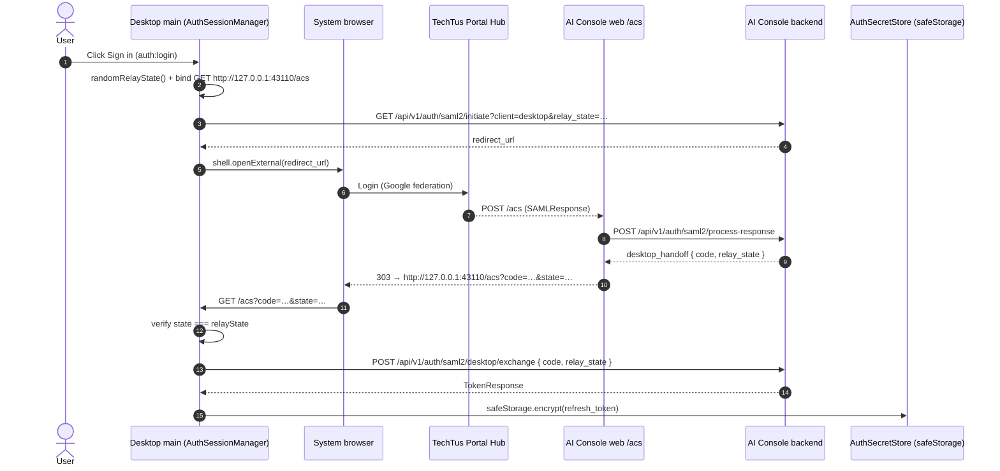

# SSO Login & LLM Token (as-built)

> **Loại tài liệu:** As-built reference cho luồng đăng nhập + lấy LLM token của desktop.
> **Phạm vi:** desktop-client. Hợp nhất từ 4 doc RFC cũ (saml2-sso-desktop, portal-login-llm-token-flow, desktop-llm-shortkey-flow, ai-console-jwt-gateway).
> **Code:** `src/auth-session.js`, `src/auth-secret-store.js`, `src/local-llm-proxy.js`, wiring trong `src/main.js`. Proxy chi tiết: [`../03-skills-runtime/local-llm-proxy.md`](../03-skills-runtime/local-llm-proxy.md).

## Context

TechTusCoWork **không** giữ long-lived LLM API key. Desktop đăng nhập qua **TechTus Portal Hub (SAML2)** thông qua AI Console, nhận AI Console session, rồi đổi lấy **short-lived LLM Gateway JWT** mỗi khi cần gọi LLM. OpenCode child không bao giờ thấy Gateway JWT — nó chỉ gọi local proxy bằng per-run token.

Các bên:

| Thành phần | Vai trò |
|---|---|
| TechTus Portal Hub | Identity Provider SAML2 (federated Google Workspace) |
| AI Console (BE + web `/acs`) | Service Provider: verify SAML, mint AI Console session + short-lived Gateway JWT |
| LLM Gateway | Resource server: verify JWT qua JWKS, enforce lane/model, proxy model |
| Desktop main process | Quản lý login, loopback callback, token store, local proxy lifecycle |
| Desktop renderer | Chỉ hiển thị login gate / account state — không giữ secret |
| OpenCode child | Đọc provider config trỏ local proxy; không biết Gateway token |

## 1. Login flow (đã implement)

`AuthSessionManager.login()` (`src/auth-session.js`) — Portal Hub đăng ký **web ACS**, không phải loopback. Desktop loopback chỉ nhận one-time handoff code.



Loopback receiver (`createLoopbackAcsReceiver`) — hiện trạng:
- Bind **chỉ** `127.0.0.1:43110` (env `OPENWORKING_SAML2_ACS_PORT`), path `/acs`.
- Chấp nhận **đúng một** `GET /acs?code=…&state=…`; thiếu `code`/`state`, sai `state`, hoặc method ≠ GET → `400`/`405` + đóng listener.
- Timeout `DEFAULT_CALLBACK_TIMEOUT_MS = 120s`; đóng listener sau success/error/timeout.
- Login xong trả HTML "Signed in" tự đóng tab.

## 2. Session storage & startup refresh (đã implement)

`AuthSecretStore` (`src/auth-secret-store.js`) lưu file `<userData>/auth-session.json`.

| Giá trị | Lưu ở đâu |
|---|---|
| AI Console refresh token | `safeStorage.encryptString()` (base64) trong userData |
| AI Console access token | **Memory only** (`AuthSessionManager.accessToken`) |
| Gateway JWT / LLM short key | **Memory only** (trong `LocalLlmProxy`) |
| Local proxy token | **Memory only**, random mỗi lần chạy |
| Portal/SAML handoff code | **Không** persist |

- `save()` luôn ghi `encrypted: true`; `assertAvailable()` fail-closed nếu `safeStorage` không khả dụng.
- Blob mã hóa đọc được chỉ khi keychain còn khả dụng — nếu không, coi như mất session (trả `refreshToken: null`) thay vì lỗi.
- Startup `refresh()`: nếu không có refresh token → `unauthenticated`; có → gọi `POST /api/v1/auth/refresh`, rotate token, set `authenticated`. Lỗi → `error` (không mở workspace/proxy).
- Trạng thái session: `disabled` (SAML2 tắt) · `unauthenticated` · `login` · `refreshing` · `authenticated` · `error`. Snapshot qua `auth:getSession`.

## 3. LLM short-key exchange (đã implement)

`AuthSessionManager.exchangeGatewayToken()` — RFC 8693 token exchange:

```http
POST /api/v1/auth/token/exchange
Authorization: Bearer <ai_console_access_token>
```
```json
{
  "grant_type": "urn:ietf:params:oauth:grant-type:token-exchange",
  "subject_token": "<ai_console_access_token>",
  "subject_token_type": "urn:ietf:params:oauth:token-type:access_token",
  "requested_token_type": "urn:ietf:params:oauth:token-type:access_token",
  "audience": "llm-gateway"
}
```

- Không còn access token → tự `refreshSessionTokens()` trước.
- Retry **một lần** khi gateway/exchange trả `401`: xoá access token, refresh session, gọi lại exchange.
- Trả `{ accessToken, expiresAt (= now + expires_in·1000), scope, tokenType }`.

`LocalLlmProxy` được wire với `getGatewayToken: () => authManager.exchangeGatewayToken()` (`src/main.js` `ensureManagedProxy`). Cache + refresh-skew + force-streaming → xem [`../03-skills-runtime/local-llm-proxy.md`](../03-skills-runtime/local-llm-proxy.md).

## 4. OpenCode provider config (đã implement)

Login thành công → `onBootstrap` → `ensureManagedProxy` start proxy rồi ghi provider config trỏ về local proxy:

```json
{
  "provider": {
    "mynavitechtus": {
      "npm": "@ai-sdk/openai-compatible",
      "options": {
        "baseURL": "http://127.0.0.1:<proxy_port>/api/v1",
        "apiKey": "{env:TECHTUS_LOCAL_PROXY_TOKEN}"
      }
    }
  }
}
```

Main inject cho OpenCode **chỉ** `TECHTUS_LOCAL_PROXY_TOKEN` (qua `getManagedSecretEnv`). Không inject Gateway JWT / AI Console token / long-lived key.

## 5. Logout (đã implement)

`auth:logout` → `AuthSessionManager.logout()` + `stopManagedProxy()`:
1. `DELETE /api/v1/auth/logout` với `Authorization: Bearer <access>` + `{ refresh_token }` (best-effort).
2. Xoá access token (memory), `store.clear()` refresh token **kể cả khi network lỗi**.
3. Stop local proxy (xoá Gateway JWT + proxy token memory).
4. Set `unauthenticated`/`disabled`. Gateway JWT đã mint vẫn có thể còn hiệu lực tới `exp` (~10 phút MVP).

## 6. Endpoint contract (AI Console)

| Bước | Endpoint |
|---|---|
| Start Portal login | `GET /api/v1/auth/saml2/initiate?client=desktop&relay_state=…` |
| Exchange handoff code | `POST /api/v1/auth/saml2/desktop/exchange` |
| Refresh session | `POST /api/v1/auth/refresh` |
| LLM short key | `POST /api/v1/auth/token/exchange` |
| Logout | `DELETE /api/v1/auth/logout` |
| Public JWKS (Gateway dùng) | `GET https://ai-console.beta.mynavitechtus.vn/.well-known/jwks.json` |

Desktop config env: `OPENWORKING_CONSOLE_API_BASE_URL` (mặc định `https://api-ai-console.beta.mynavitechtus.vn`), `OPENWORKING_SAML2_ENABLED` (mặc định bật), `OPENWORKING_SAML2_ACS_PORT` (43110).

## 7. Gateway JWT contract (reference)

JWT RS256, header `{ alg: RS256, kid, typ: JWT }`. Claims do AI Console mint:

```json
{
  "iss": "https://ai-console.beta.mynavitechtus.vn",
  "aud": "llm-gateway",
  "sub": "<ai_console_user_id>",
  "exp": "...", "iat": "...", "nbf": "...",
  "jti": "gtw_tok_<uuid>",
  "sid": "<ai_console_access_token_jti>",
  "tenant": "mynavitechtus",
  "preferred_username": "<email_local_part>",
  "lanes": ["generative", "embedding", "rerank"],
  "models": ["google/gemma-4-31B-it", "BAAI/bge-m3", "BAAI/bge-reranker-v2-m3"],
  "rate_limit": { "requests_per_minute": 30 }
}
```

LLM Gateway verify: reject `alg=none`; `kid` ∈ JWKS; validate chữ ký, `iss`/`aud`/`exp`/`nbf`/`iat`; enforce lane/model entitlement; rate-limit theo `sub`. `preferred_username` là khóa report end-user. Backend contract đầy đủ (JWKS rotation, env signing key, token TTL) ở workspace-root [`../../../docs/sso-login.md`](../../../docs/sso-login.md).

## 8. Failure modes (hợp nhất)

| Trường hợp | Hành vi desktop |
|---|---|
| Login huỷ / loopback sai `state` | Reject callback, đóng listener, ở lại login gate |
| Code exchange `401` (expired/replayed) | Yêu cầu đăng nhập lại |
| `safeStorage` không khả dụng | Fail closed; không lưu refresh token plaintext |
| Startup refresh fail | Không mở workspace/proxy; hiển thị lỗi |
| Token exchange `400` | Bug contract; log redacted, fail request |
| Token exchange `401` | Refresh session một lần, retry exchange một lần |
| Token exchange `403` | User inactive/no entitlement; logout local + access denied |
| Token exchange `503` | AI Console signing unavailable; fail proxy request, không forward |
| Gateway `401` (token hết hạn / sai iss/aud/kid/alg) | Proxy refresh + retry một lần (an toàn); nếu vẫn fail → surface lỗi |
| Gateway `403` entitlement | Surface model/access denied; không retry |

## Cross-cutting / Security
- System browser, **không** embedded webview. Loopback + local proxy bind **chỉ** `127.0.0.1`.
- **Không** log SAMLResponse, handoff code, AI Console token, Gateway JWT, local proxy token. Redact `Authorization`/`apiKey`/token-like trong diagnostics.
- **Không** ghi Gateway JWT vào `opencode.json`, crash log, hay renderer state.
- Managed provider API key giữ ẩn/read-only trong UI.

## Tham chiếu
- Local proxy chi tiết: [`../03-skills-runtime/local-llm-proxy.md`](../03-skills-runtime/local-llm-proxy.md).
- Backend/frontend contract end-to-end: workspace-root [`../../../docs/sso-login.md`](../../../docs/sso-login.md).
- [RFC 8693: OAuth 2.0 Token Exchange](https://www.rfc-editor.org/rfc/rfc8693) · [Electron safeStorage](https://www.electronjs.org/docs/latest/api/safe-storage)
