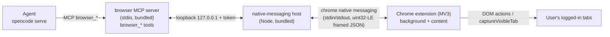

# Browser-Use — Control the User's Chrome (as-built)

> **Loại tài liệu:** As-built. Mô tả hiện trạng code của tính năng "điều khiển trình duyệt" của agent
> theo mô hình **Claude-for-Chrome**.
> **Phạm vi:** `desktop-client/` — Chrome extension + native-messaging host + browser MCP + app bridge.
> **Modules:** `resources/browser-extension/`, `resources/browser-host/`, `resources/browser-mcp/`,
> `src/browser-bridge.js`. Tests: `test/browser-host.test.js`, `test/browser-mcp.test.js`,
> `test/browser-bridge.test.js`, `test/browser-extension.test.js`, `test/opencode-profile.test.js`.

## Context

Mục tiêu: agent trong TechTusCoWork có thể **điều khiển chính Chrome đã đăng nhập của người dùng**
(navigate, đọc trang, click, gõ, chụp màn hình), giống **Claude-for-Chrome** / OpenWork Labs
"control the browser". Agent thao tác trên **session thật** (Gmail, tool nội bộ…), không phải một
trình duyệt rỗng.

Trong kiến trúc OpenCode của app, năng lực của agent được expose dưới dạng **MCP tools**. Có hai cách
chạm tới Chrome thật:

1. **CDP-attach** (`@playwright/mcp --cdp-endpoint`): attach vào một Chrome khởi động kèm
   `--remote-debugging-port`. Nhẹ nhưng buộc người dùng **khởi động lại Chrome** một lần và mở ra một
   CDP surface cục bộ mạnh. → **bị loại** cho v1.
2. **Extension + native messaging** (mô hình thật của Claude-for-Chrome): một **Chrome extension**
   thực thi hành động DOM, nói chuyện với một **native-messaging host** cục bộ; agent chạm tới host
   qua **MCP tools**. **Không** cần `--remote-debugging-port`, **không** khởi động lại Chrome,
   permission rõ ràng hơn. → **chọn cho v1.**

### Quyết định (user, 2026-06-27)
- **Phân phối extension:** **unpacked dev extension** cho v1 — đóng gói trong `.app`; người dùng bật
  Chrome Developer Mode và "Load unpacked" theo hướng dẫn trong app. Web Store là fast-follow (cấu
  trúc extension để việc lên store về sau chỉ là bước cộng thêm).
- **Phạm vi v1:** **macOS + Chrome stable** (đúng target đang đóng gói duy nhất). Windows/Linux và các
  kênh Chromium khác (Brave/Edge) là fast-follow qua cùng extension id + thêm đường dẫn manifest.

## Design

Bốn lớp, một cầu nối:



### Các lớp
1. **Chrome extension** (`resources/browser-extension/`, MV3) — background service worker + content
   script. Kết nối host qua `chrome.runtime.connectNative`, thực thi `navigate` / đọc DOM-snapshot /
   `click` / `type`/`fill` / screenshot (`chrome.tabs.captureVisibleTab`) trên **tab đã đăng nhập**
   của người dùng. Action popup hiển thị trạng thái kết nối. Logic mỏng, ưu tiên đẩy việc về host.
2. **Native-messaging host** (`resources/browser-host/`) — tiến trình Node nhỏ. Giao thức Chrome
   native messaging: khung **uint32-LE length-prefixed JSON** trên stdin/stdout. Đồng thời mở **loopback
   127.0.0.1 + token** để browser MCP gửi lệnh và nhận kết quả; host relay lệnh ↔ extension.
3. **Browser MCP server** (`resources/browser-mcp/`) — stdio MCP expose các tool namespaced `browser_*`
   cho agent, forward mỗi lệnh tới host qua loopback, trả kết quả/screenshot dưới dạng **tool output**.
   Là grandchild của `opencode serve` (giống mọi local MCP).
4. **App bridge + UX** (`src/browser-bridge.js`, `src/main.js`, `src/preload.js`, `src/renderer.js`)
   — phát hiện Chrome stable trên macOS; ghi/validate **NativeMessagingHosts manifest** trỏ tới host
   đã bundle và **allowlist extension id**; cấp free port + token; màn Extensions hướng dẫn
   load/enable extension + nút Install host + trạng thái live.

### Contract lệnh (extension ↔ host ↔ MCP)
JSON request/response tối giản:
`{ id, op: "navigate"|"read"|"click"|"type"|"screenshot", params }` →
`{ id, ok: true, result }` hoặc `{ id, ok: false, error }`
(`resources/browser-host/protocol.js`: `OPS`, `isValidCommand`, `okResult`, `errorResult`).
Khung **uint32-LE length-prefixed JSON** đúng chuẩn native messaging giữa host↔extension
(`encodeMessage`/`createMessageDecoder`, có cap kích thước để chống cạn RAM). Chiều MCP↔host là
**newline-delimited JSON trên loopback 127.0.0.1**, mỗi request kèm `token`; host route reply về đúng
MCP connection theo `id` (`resources/browser-host/bridge.js`).

**Rendezvous host↔MCP:** app ghi `host.token` (0600) vào thư mục dùng chung
`~/Desktop/openworking-browser-host/` (mặc định; override bằng env `OPENWORKING_BROWSER_HOST_DIR` —
xem `browserHostDir()` trong `src/main.js`); host bind cổng loopback ngẫu nhiên rồi ghi `host.port`;
MCP đọc cả hai để kết nối (`resources/browser-mcp/host-client.js`). Cả host lẫn MCP nhận thư mục này
qua env `OPENWORKING_BROWSER_HOST_DIR`.

### Tool surface (`browser_*`)
Do **app tự định nghĩa** (ta tự viết MCP). Tối thiểu cho v1: `browser_navigate`, `browser_read`
(DOM snapshot/text), `browser_click`, `browser_type`, `browser_screenshot`. Giữ danh sách này **đồng
bộ** với `askToolPermissions` của skill `browser-use`.

### Skill `browser-use`
`resources/opencode/skills/browser-use/SKILL.md` dạy vòng lặp **navigate → read → act → verify** và
khai báo `askToolPermissions: browser_click, browser_type, …` để runtime hỏi **Allow/Reject** trước
mỗi hành động mutating (xem cơ chế `parseAskToolPermissions` ở [built-in-skills](built-in-skills.md)).

### Đóng gói
Extension/host/mcp ship qua `extraResources` (giống `resources/opencode` ở `package.json`); phần
native cần `asarUnpack`. `npm run smoke:packaged` phải assert ba thư mục được bundle và host (đã ký)
chạy được với PATH tối thiểu.

### Discovery của runtime
Browser MCP được khai báo trong `opencode.json` `mcp` dưới entry **`browser`** (managed, app sở hữu) qua
`ensureBrowserMcpServer` (`src/opencode-profile.js`). main.js cấp `command` = `[process.execPath,
<resources>/browser-mcp/index.js]` với env `ELECTRON_RUN_AS_NODE=1` — chạy MCP bằng **chính binary
Electron ở chế độ node** nên **không cần system node** trong `.app` đã đóng gói. Entry được re-ensure mỗi
lần `ensureOpenworkingProfile` chạy (launch + open/start project). Trạng thái connect chảy về renderer
qua các event `mcp.status.*` đã có.

IPC mới **duy nhất**: nhóm `browser:*` ở `src/main.js` → `src/preload.js`
(`window.openworking.browser.*`):
- `browser:status` → `browserBridge.status()` (Chrome có cài? host manifest hợp lệ + pin đúng extension
  id? token đã ghi?).
- `browser:installHost` → ghi token sidecar + launcher shim + NativeMessagingHosts manifest, rồi
  re-ensure entry MCP.
- `browser:openExtensionPage` → mở thư mục extension đã bundle để user "Load unpacked".

**Native host launcher:** Chrome yêu cầu `path` trong manifest trỏ tới một file thực thi; host là script
Node nên `installHost` sinh một shim `run-host.sh` exec `process.execPath` (Electron) ở
`ELECTRON_RUN_AS_NODE=1` với `host.js` (`buildLauncherScript`). Manifest `allowed_origins` chỉ chứa
`chrome-extension://<BROWSER_EXTENSION_ID>/`.

**Extension id cố định:** `resources/browser-extension/manifest.json` nhúng một `key` công khai cố định
→ Chrome luôn load unpacked với cùng một id (`BROWSER_EXTENSION_ID` trong `src/browser-bridge.js`).
`test/browser-extension.test.js` khẳng định id suy ra từ `key` khớp đúng giá trị bridge allowlist.

## Vòng đời host & lỗi "Native host has exited" / `ENOENT host.port`

**Ai khởi chạy host?** Native host **chỉ** chạy khi extension gọi `chrome.runtime.connectNative` — Chrome
mới spawn host (qua `run-host.sh`), host mới bind loopback và ghi `host.port`. App/MCP **không** tự khởi
chạy host được (đặc thù native messaging: Chrome sở hữu vòng đời host).

**Nguyên nhân lỗi đã gặp (2026-06-28):**
1. **MV3 service worker bị Chrome cho ngủ** sau ~30s rảnh → native port rớt → Chrome kết thúc host → host
   `exit` (stdin end). Khi MCP gọi sau đó, **không có host** → đọc `host.port` ra `ENOENT`.
2. **Thiếu `host.token`** ở data dir (vd vừa đổi data dir mà chưa **Install host** lại) → host cũ crash
   thô ở `readFileSync` → Chrome chỉ báo "Native host has exited" (không rõ lý do).
3. **`host.port` stale**: host chết nhưng để lại port cũ → MCP nối vào → `ECONNREFUSED`.

**Cách khắc phục đã triển khai (4 file):**
- `background.js` — `chrome.alarms` heartbeat (~30s) gọi `ensurePort()` + auto-reconnect có backoff trong
  `onDisconnect`, và reconnect trên `onStartup`/`onInstalled`. Giữ host sống suốt thời gian Chrome+extension
  mở. Cần quyền `alarms`.
- `host.js` — `readTokenSafe` thoát có kiểm soát + ghi lý do (không crash câm); ghi `host.port` **atomic**
  (tmp→rename); `cleanup()` xóa `host.port` trên `exit`/`SIGTERM`/`stdin end` (không để stale).
- `host-client.js` (MCP) — `send()` **poll ~4s** chờ host sẵn sàng (ENOENT/`ECONNREFUSED` đều retriable),
  rồi báo lỗi rõ ràng: *"browser host unavailable: Chrome extension is not connected … click Reconnect host."*

**Chẩn đoán bằng `host.log`:** host ghi mỗi sự kiện vòng đời vào `<host-dir>/host.log` (Chrome nuốt stderr
nên đây là cửa sổ duy nhất nhìn vào host khi Chrome khởi chạy nó):
```
host launched (argv=[...])
listening on 127.0.0.1:<port>
host exiting (stdin end | SIGTERM)
```
Quy trình chẩn đoán: `cat <host-dir>/host.log`; `pgrep -fl browser-host/host.js` (host có sống?);
kiểm `host.port` tồn tại. Khắc phục vận hành khi hỏng: **Install host** trong app → reload extension ở
`chrome://extensions` → popup **Reconnect host**.

**⚠️ TCC — host-dir KHÔNG được nằm trong `~/Desktop`, `~/Documents`, `~/Downloads`:** macOS TCC chặn
**Chrome** thực thi launcher native-host trong các thư mục riêng tư này. Khi bị chặn, `connectNative`
vẫn trả về một `port` (nên popup extension hiển thị "Host connected" **sai**), nhưng host **không bao giờ
chạy** → `host.log` trống, không có tiến trình host, MCP poll timeout. Chạy shim từ Terminal thì OK
(Terminal có quyền), nên lỗi này dễ gây hiểu nhầm là "host script lỗi". **Triệu chứng đặc trưng: popup
báo connected nhưng `host.log` trống + không có tiến trình host.** `browserHostDir()` (`src/main.js`) vì
vậy đặt host-dir dưới `userData` (không bị TCC chặn, đúng local-first). Env `OPENWORKING_BROWSER_HOST_DIR`
vẫn override cho dev — nhưng đừng trỏ vào thư mục TCC-protected.

## Cross-cutting / Security

- **Native host khoá theo extension id**: Chrome enforce qua `allowed_origins` trong manifest — chỉ
  extension đã bundle mới nói chuyện được với host.
- **Loopback MCP↔host**: bind **chỉ** `127.0.0.1`, token per-launch ngẫu nhiên. Thêm token vào tập
  redaction của Diagnostics.
- **Không** expose `--remote-debugging-port`; không tạo CDP surface tuỳ ý.
- **HITL gating**: mọi tool mutating đi qua `ask` (agent đang chạm session đã xác thực thật).
- **Local-first**: không ghi vào project folder hay `~/.config/opencode`; host/manifest sống dưới
  app-managed profile / thư mục config của Chrome.
- **Signing/notarization**: host và MCP **không** là binary riêng — chúng là script Node chạy bằng chính
  binary Electron của app (đã ký + notarize). Chỉ cần shim `run-host.sh` (sinh tại userData) và ba thư
  mục `extraResources` (`browser-host`/`browser-mcp`/`browser-extension`) được bundle; `smoke:packaged`
  nên assert ba thư mục có mặt.
- **Permission surface (extension)**: `manifest.json` xin `nativeMessaging`, `activeTab`, `scripting`,
  `tabs`, `alarms` — **không** có `host_permissions`/`<all_urls>`. (`alarms` là heartbeat keep-alive cho
  service worker.) Thao tác DOM được inject theo nhu cầu vào tab đang active qua
  `chrome.scripting.executeScript` (activeTab), nên không cần content script tĩnh khớp mọi URL. Reviewer
  coi app bridge (Task 5) là **security review**.
- Giữ biên renderer↔main hẹp: thêm năng lực qua `preload.js`, chiếu xuống field allowlist.

## Verification

Unit (rẻ trước):
- `node --test test/opencode-profile.test.js` — skill `browser-use` được sync (16 skill) +
  `askToolPermissions` được chiếu thành `ask`.
- `node --test test/browser-host.test.js` — khung uint32-LE encode/decode, token auth, round-trip.
- `node --test test/browser-mcp.test.js` — tool schema, forward-to-host, error mapping.
- `node --test test/browser-bridge.test.js` — phát hiện Chrome, đường dẫn manifest, ghi/validate
  manifest, free port + token.
- `npm test` — toàn bộ unit + check `opencode debug skill` đủ 16 tên.

Đắt (xin phép trước): `npm run smoke:electron`, `npm run smoke:packaged` (assert bundle + ký),
`npm run dev` end-to-end trên một tab đã đăng nhập.

End-to-end (manual): Extensions → Browser (Chrome) → load/enable extension + Install host → card +
popup báo connected → chat "tóm tắt email chưa đọc mới nhất trong tab Gmail đang mở" → agent dùng
`browser_*` trên tab thật, mỗi hành động mutating hiện Allow/Reject.

## Tham chiếu

- [built-in-skills.md](built-in-skills.md) — cơ chế skill/MCP, `askToolPermissions`, `mcp` key.
- [architecture-overview.md](../01-architecture/architecture-overview.md) — IPC surface, runtime
  lifecycle, security boundaries, part allowlist (`tool` part mang screenshot).
- `src/mcp-install.js` — mẫu cài local MCP on-demand (dùng lại nếu browser MCP được npm-install thay
  vì bundle).
- [04-release-packaging/local-run-verification.md](../04-release-packaging/local-run-verification.md)
  — verify gói + smoke cho các resource bundle mới.
- Mô hình thay thế đã loại: CDP-attach (`@playwright/mcp --cdp-endpoint`) — cần khởi động lại Chrome
  và mở remote-debugging-port; ghi nhận làm follow-up nếu cần bản nhẹ.
